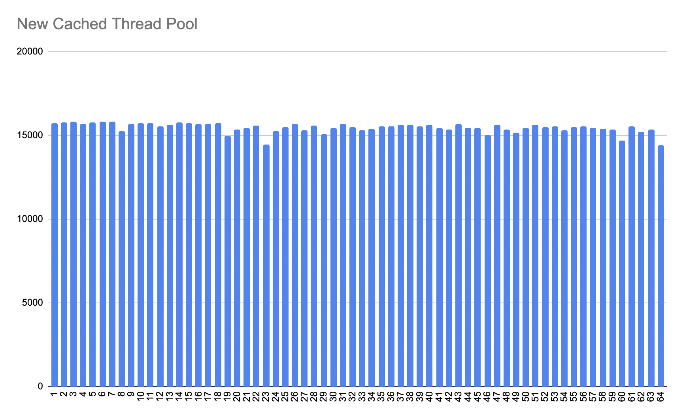
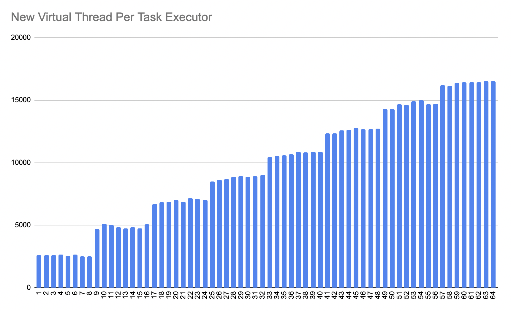

# Virtual Threads

Virtual threads are lightweight implementations of `java.lang.Thread` and they promise to write highly scalable concurrent applications. The main benefit of Virtual Threads is that you can stick to the familiar `thread-per-request programming model` without scaling problems.

This module elucidates the fundamental principles and components of Virtual Threads through illustrative examples.

## Starting Virtual Thread

JDK provides factory methods on the new `builder interface` to create Virtual Threads.

<details>
<summary>org.jugistanbul.virtualthread.factory.PlatformThreadPerTask.java</summary>

[This example](https://github.com/hakdogan/loom-examples/blob/main/virtual-threads/src/main/java/org/jugistanbul/virtualthread/factory/PlatformThreadPerTask.java) shows the natural boundaries of creating platform threads. The boundaries are related whit system resources and remember that, it can be different based on your system resource.

```java
try(var executor = Executors.newCachedThreadPool()){
            IntStream.range(0, 5000)
                    .forEach(i -> {
                        executor.submit(() -> {
                            Thread.sleep(Duration.ofSeconds(1));
                            return i;
                        });
                    });
        }
```
</details>

<details>
<summary>org.jugistanbul.virtualthread.factory.VirtualThreadPerTask.java</summary>

[This example](https://github.com/hakdogan/loom-examples/blob/main/virtual-threads/src/main/java/org/jugistanbul/virtualthread/factory/VirtualThreadPerTask.java) shows how to use the new `newVirtualThreadPerTaskExecutor` to start a Virtual Thread for each task.

```java
try(var executor = Executors.newVirtualThreadPerTaskExecutor()){
        IntStream.range(0, 100_000).forEach(i -> {
                executor.submit(() -> {
                Thread.sleep(Duration.ofSeconds(1));
                return i;
            });
        });
}
```
</details>

<details>
<summary>org.jugistanbul.virtualthread.factory.StartVirtualThread.java</summary>

[This example](https://github.com/hakdogan/loom-examples/blob/main/virtual-threads/src/main/java/org/jugistanbul/virtualthread/factory/StartVirtualThread.java) shows how to use the new `startVirtualThread` factory method to start a Virtual Thread.

```java
Thread.startVirtualThread(() -> System.out.println("Hello from Virtual Thread"));
```
</details>

<details>
<summary>org.jugistanbul.virtualthread.builder.Unstarted.java</summary>

[This example](https://github.com/hakdogan/loom-examples/blob/main/virtual-threads/src/main/java/org/jugistanbul/virtualthread/builder/Unstarted.java) shows how to create a Virtual Thread that will not be started until the `start()` method is invoked with the new `Builder API`.

```java
Thread.ofVirtual().unstarted(() -> System.out.println("Hello from postponed Virtual Thread"));
```
</details>

<details>
<summary>org.jugistanbul.virtualthread.builder.Factory.java</summary>

[This example](https://github.com/hakdogan/loom-examples/blob/main/virtual-threads/src/main/java/org/jugistanbul/virtualthread/builder/Factory.java)  shows how to use `ThreadFactory` to create Virtual Threads.

```java
    var virtualThreadFactory = Thread.ofVirtual().factory();
    runWithExecutor(platformThreadFactory);

    var virtualThread = virtualThreadFactory.newThread(Factory::sayHello);
    virtualThread.start();
    
    ...

    private static void runWithExecutor(final ThreadFactory threadFactory){

        try (var executor = Executors.newThreadPerTaskExecutor(threadFactory)) {
            IntStream.rangeClosed(0, 4).forEach(i ->
                executor.submit(() -> {
                    Thread.sleep(Duration.ofSeconds(1));
                    System.out.println("Is virtual: " + Thread.currentThread().isVirtual());
                    return i;
                }));
            }
        }
```
</details>

## Continuations

In `Project Loom`, a `continuation` is an object that may suspend or yield execution at some point by itself and, when resumed or invoked, carries out the rest of some computation.

<details>
<summary>org.jugistanbul.virtualthread.continuation.YieldExecution.java</summary>

[This example](https://github.com/hakdogan/loom-examples/blob/main/virtual-threads/src/main/java/org/jugistanbul/virtualthread/continuation/YieldExecution.java) shows the yield execution behavior of the `Continuation` object.

```java
        ContinuationScope scope = new ContinuationScope(SCOPE_NAME);

        Continuation continuation = new Continuation(scope, () -> {
            System.out.println("Continuation is running");
            Continuation.yield(scope);
            System.out.println("Continuation is still running");
        });

        continuation.run();
```

```shell
java --add-exports java.base/jdk.internal.vm=ALL-UNNAMED \
src/main/java/org/jugistanbul/virtualthread/continuation/YieldExecution.java
```
</details>

<details>
<summary>org.jugistanbul.virtualthread.jump.ThreadJump.java</summary>

[This example](https://github.com/hakdogan/loom-examples/blob/main/virtual-threads/src/main/java/org/jugistanbul/virtualthread/jump/ThreadJump.java) shows the `thread jump` behavior that may be observed when a Virtual Thread `mounts` on a Platform Thread again after `unmounted`.

```java
    var threadList = IntStream.range(0, 10)
        .mapToObj(i -> Thread.ofVirtual().unstarted(() -> {

            if(i == 0) {
                System.out.println(Thread.currentThread());
            }
    
            ThreadUtil.sleepOfMillis(25);
    
            if(i == 0) {
                System.out.println(Thread.currentThread());
            }

    })).toList();

    threadList.forEach(Thread::start);
    ThreadUtil.joinAll(threadList);
```
</details>

## Thread Pinning

There are two cases where a blocking operation doesn't `unmount` the virtual thread from the `carrier thread`:

1) When the virtual thread executes a `synchronized` block or method code
2) When it calls a `native method` or a `foreign function`

In these cases, the virtual thread is pinned to the carrier thread.

<details>
<summary>org.jugistanbul.virtualthread.pin.ThreadPinned.java</summary>

[This example](https://github.com/hakdogan/loom-examples/blob/main/virtual-threads/src/main/java/org/jugistanbul/virtualthread/pin/ThreadPinned.java) shows the `pinning event` that occurs when the virtual thread executes a `synchronized block` or method code.

```java
        var threadList = IntStream.range(0, 10)
                .mapToObj(i -> Thread.ofVirtual().unstarted(() -> {

                    if (i == 0) {
                        System.out.println(Thread.currentThread());
                    }

                    synchronized (lock) {
                        ThreadUtil.sleepOfMillis(25);
                    }

                    if (i == 0) {
                        System.out.println(Thread.currentThread());
                    }

                })).toList();
```
</details>

<details>
<summary>org.jugistanbul.virtualthread.pin.PreventPinning.java</summary>

[This example](https://github.com/hakdogan/loom-examples/blob/main/virtual-threads/src/main/java/org/jugistanbul/virtualthread/pin/PreventPinning.java) shows how to prevent `pinning event`.

```java
    var threadList = IntStream.range(0, 10)
        .mapToObj(i -> Thread.ofVirtual().unstarted(() -> {

        if (i == 0) {
            System.out.println(Thread.currentThread());
        }

        lock.lock();
        try {
            ThreadUtil.sleepOfMillis(25);
        } finally {
            lock.unlock();
        }

        if (i == 0) {
            System.out.println(Thread.currentThread());
        }
    })).toList();
```
</details>

## Monitoring

In addition to existing ones, there are several new runtime parameters and events that the JDK provides to be able to monitor behaviors related to virtual threads.

<details>
<summary>org.jugistanbul.virtualthread.pool.ListPlatformThreads.java</summary>

[This example](https://github.com/hakdogan/loom-examples/blob/main/virtual-threads/src/main/java/org/jugistanbul/virtualthread/pool/ListPlatformThreads.java) shows a way to observe how many `platform threads` are used to run N number of virtual threads.


```java
    var threadList = IntStream
        .range(0, 100_000)
        .mapToObj(_ -> Thread.ofVirtual().unstarted(() -> {

            var poolName = getPoolName();
            poolNames.add(poolName);
    
            var workerName = getWorkerName();
            pThreadNames.add(workerName);

        })).toList();

        var start = Instant.now();
        threadList.forEach(Thread::start);
        ThreadUtil.joinAll(threadList);

        System.out.println(STR."Execution time:  \{ThreadUtil.benchmark(start)} ms");
        System.out.println(STR."Core             \{Runtime.getRuntime().availableProcessors()}");
        System.out.println(STR."Pools            \{poolNames.size()}");
        System.out.println(STR."Platform threads \{pThreadNames.size()}");
```
</details>

<details>
<summary>org.jugistanbul.virtualthread.monitor.MonitoringPinningEvent.java</summary>

[This example](https://github.com/hakdogan/loom-examples/blob/main/virtual-threads/src/main/java/org/jugistanbul/virtualthread/monitor/MonitoringPinningEvent.java)  shows how to monitor the `pinning event` using `jdk.tracePinnedThreads` flag.

```shell
java --enable-preview --source 22 \
-cp ../util/target/classes/ \
-Djdk.tracePinnedThreads=short \
src/main/java/org/jugistanbul/virtualthread/monitor/MonitoringPinningEvent.java
```
</details>

<details>
<summary>org.jugistanbul.virtualthread.monitor.NativeMemoryTracking.java</summary>

[This example](https://github.com/hakdogan/loom-examples/blob/main/virtual-threads/src/main/java/org/jugistanbul/virtualthread/monitor/NativeMemoryTracking.java) shows how the amount of memory allocated to threads(Platform and Virtual) can be observed with jcmd and JFR through NMT.

```java
        var threadCount = defineThreadCount(args[0]);
        var threadType  = defineThreadType(args[1]);
        var jcmd        = args.length >= 3 && defineUsedJcmd(args[2]);
        var printTime   = threadCount - 1;

        System.out.println(STR."Thread count set to \{threadCount}");

        try(var executor = defineExecutorService(threadType)){

            IntStream.range(0, threadCount).forEach(i -> {

                if(jcmd && i == printTime){
                    memoryTracking(pid, threadType);
                }

                executor.execute(() -> ThreadUtil.sleepOfSeconds(5));
            });
        }
```
```shell
sh runNativeMemoryTracking.sh 12000 VIRTUAL false #don't use jcmd to access nmt
```
</details>

<details>
<summary>org.jugistanbul.virtualthread.scheduler.CooperativeScheduling.java</summary>

[This example](https://github.com/hakdogan/loom-examples/blob/main/virtual-threads/src/main/java/org/jugistanbul/virtualthread/scheduler/CooperativeScheduling.java) shows the way to observe scheduler behavior with runtime parameters such as

- jdk.virtualThreadScheduler.parallelism
- jdk.virtualThreadScheduler.maxPoolSize
- jdk.virtualThreadScheduler.minRunnable

```shell
java --enable-preview --source 22 \
-cp ../util/target/classes/ \
-Djdk.virtualThreadScheduler.parallelism=1 \
-Djdk.virtualThreadScheduler.maxPoolSize=1 \
-Djdk.virtualThreadScheduler.minRunnable=1 \
src/main/java/org/jugistanbul/virtualthread/scheduler/CooperativeScheduling.java
```
</details>

## CPU Bound Workloads

Virtual Threads offer a scalability benefit for `IO-bound` workloads, but relatively little for `CPU-bound` ones.

<details>
<summary>org.jugistanbul.virtualthread.boundary.CpuBounded.java</summary>

[This example](https://github.com/hakdogan/loom-examples/blob/main/virtual-threads/src/main/java/org/jugistanbul/virtualthread/boundary/CpuBounded.java) shows a way to observe the difference in scheduler behavior when virtual and platform threads are used in `CPU-bound` workloads.


```java
    IntStream
        .rangeClosed(1, 64)
        .forEach(index -> {

Instant start = Instant.now();
            executor.submit(() -> {
        IntStream
        .range(0, 50_000_000)
                    .mapToObj(BigInteger::valueOf)
                    .reduce(BigInteger.ZERO, BigInteger::add);

                System.out.println(STR."\{createTwoDigitId(index)};\{ThreadUtil.benchmark(start)}");
        });
        });

        ThreadUtil.shutdownAndAwaitTermination(executor, TimeUnit.HOURS);
```



</details>